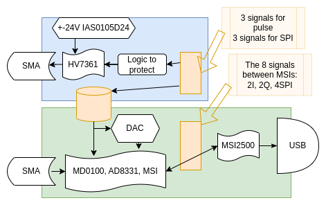

# Update of MSI Board

## Idea : Restructure the existing board.

* Split the board in to, one for pulser the other for analog acquisition
  * Board 1: Pulser (same as MSI board) plus the HV source from the motherboard ( see https://github.com/kelu124/lit3rick/blob/lit3-32/helper_board/Schematic_File.PDF with the IAS source)
  * Board 2: AD8331 + MSIs + DAC
* Analog signals
  * Pulser output goes to SMA
  * Input to AD8331 goes from SMA.

* 3 PMODs over 2 cards:
  * 1 PMOD input for the pulser
  * 1 PMOD for SPI DAC inputs 
  * 1 PMOD-like connector (not standard) for providing 3.3V and 5V to the pulser from the VGA board

* A 2.54mm header that exposes the signals between the two MSI chips (2xI signals, 2xQ signals, 4x SPI signals)

