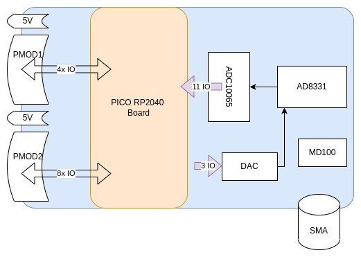

# Project

## Design 

* Tool: KICAD
* Dimension of the board: standard credit card
* Layers: up to four
* Passives: using 1206 as much as possible, spaced layout where feasible, clear silkscreen.

## Organisation

## Components

* Central, pico, to solder on the board
* Acquisition - 14 IOs used.
  * MD0100: AFE protection
  * AD8331: Variable gain (3 SPI IO)
  * (DAC to control AD8331 gain)
  * Acquisition: ADC10065, 10bits ADC (10IO + 1clk)
* Other side - exposes remaining 12 IOs.
  * PMOD extension with free IOs from PICO - reference as PMOD1A/PMOD1B (in [this picture](https://www.crowdsupply.com/img/26cc/b3ff769f-8195-40e5-88b3-47b8051c26cc/icebreaker-v1-0b-legend.jpg)), with 5V and GND in between. Contains 8 IOs each.
  * In this case, providing 1 PMOD with 4 IO, 1 with 8 IOs

# Previous designs to reuse:

* Front end from [this design](https://github.com/kelu124/un0rick/blob/master/hardware/MATTY-V11.pdf) (PDF only)
* 